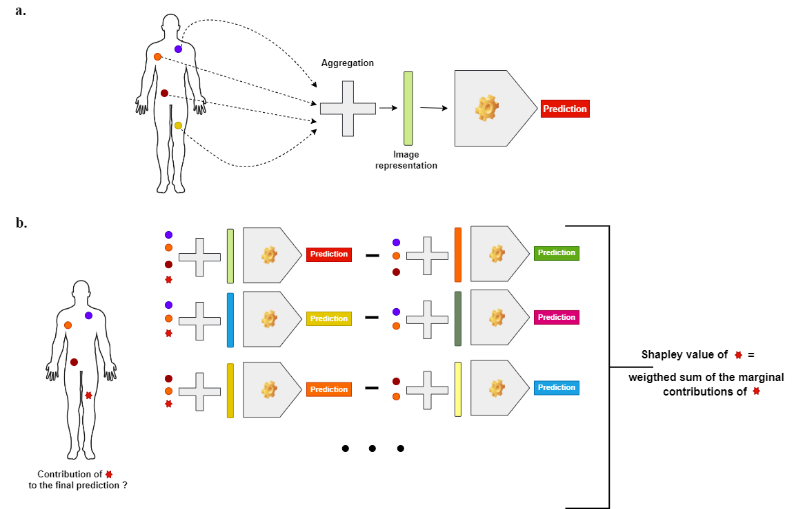

# radshap

This repository proposes a python tool for highlighting the contribution of different regions of interest (ROIs) to the predictions of radiomic models.
It estimates the Shapley value of the different ROIs of an image that a trained radiomic model uses to obtain a prediction.

## Graphical abstract

<p align="center">
    
</p>
<b>a.</b> schematic view of a generic aggregated radiomic model - <b>b.</b> computation of a Shapley value for a specific region.

## Install

### Install from source
```
pip install git+https://github.com/ncaptier/radshap.git
```
## Experiments
We provide a jupyter notebook for an illustration with PET images and simple aggregation strategies:
* [Classification of Non-Small Cell Lung Cancer subtype and interpretation with Shapley values](examples/nsclc_subtype_classification.ipynb)

## Examples
```python
import numpy as np
import joblib
from radshap.shapley import Shapley

model = joblib.load("trained_logistic_regression.joblib")
shap = Shapley(predictor = lambda x: model.predict_proba(x)[:, 1], aggregation = ('mean', None))
shap.explain(X) # X a 2D array of shape (n_instances, n_instance_features)
```
## Acknowledgements

This package was created as a part of the PhD project of Nicolas Captier in the [Laboratory of Translational Imaging in Oncology (LITO)](https://www.lito-web.fr/en/) of Institut Curie.