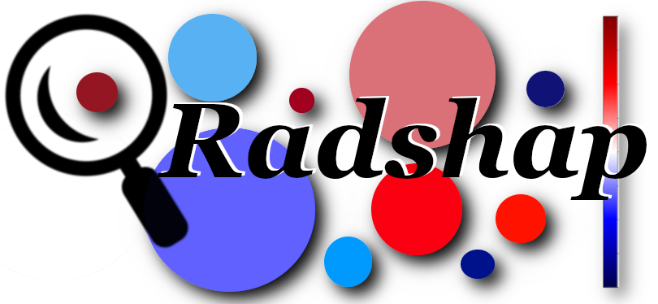

Welcome to radshap's documentation!
===================================

We hope it will guide you through the use of our package for any of your projects.

If you have any questions about radshap, or if you want to report an issue, please do not hesitate to `contact us <about.html#contact-us>`_ or raise an issue on `GitHub <https://github.com/ncaptier/radshap/issues>`_.

What is radshap ?
=================

Radshap is a python tool for highlighting the contribution of different regions of interest (ROIs) to the predictions of radiomic models. It estimates the Shapley value of the different ROIs of an image that a trained radiomic model uses to obtain a prediction.

Indices and tables
==================

* :ref:`genindex`
* :ref:`modindex`
* :ref:`search`

.. toctree::
   :maxdepth: 1
   :hidden:

   Install
   api
   examples
   release
   about
